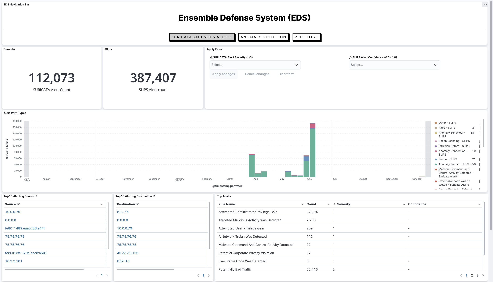
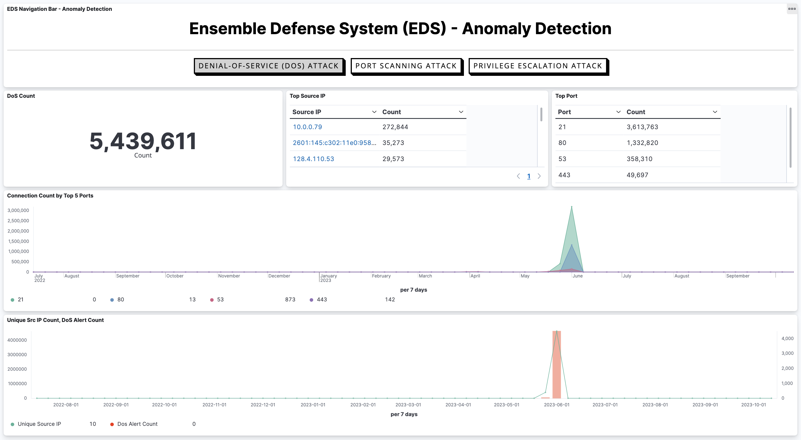
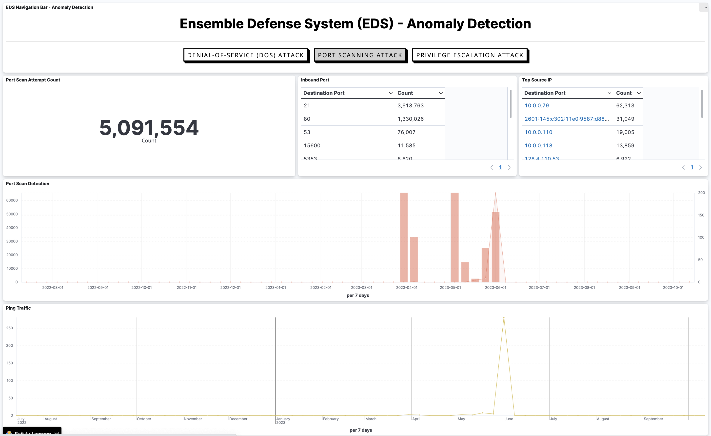
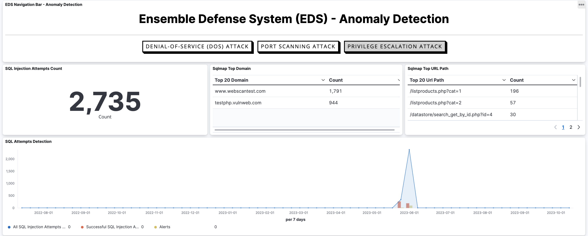
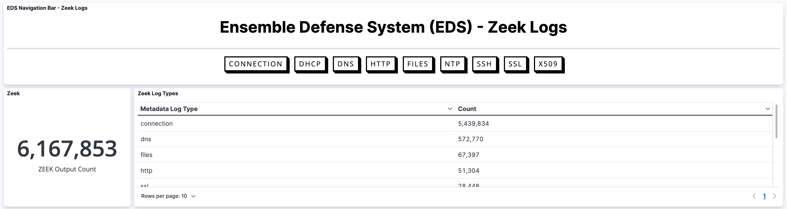

<div align="center">
   
</div>

## Description

The Ensemble Defense System (EDS) is a powerful cybersecurity framework designed to safeguard computer networks from cyber threats. EDS combines the capabilities of multiple security tools, creating a comprehensive defense strategy against cyber-attacks.

## Table of Contents

- [Description](#description)
- [Table of Contents](#table-of-contents)
- [Initial Setup](#initial-setup)
- [Installation DVWA](#installation-dvwa)
- [Installation EDS](#installation-eds)
- [Easy Installation](#easy-installation)
- [Features](#features)
- [Screenshots](#screenshots)

## Initial Setup
You must have the following prerequisites installed on your machine before running the Ensemble Defense System:
```bash
chmod +x init.sh
./init.sh
```

## Installation DVWA
DVWA is a vulnerable web application that is used to demonstrate common web application vulnerabilities. To install DVWA, follow the steps below:
```bash
docker compose -f docker-compose.dvwa.yaml up -d
# OR
docker-compose -f docker-compose.dvwa.yaml up -d
```

## Installation EDS
To install the Ensemble Defense System, follow the steps below:
1. **Clone the Repository**:

   First, clone the repository to your local machine using the following command:
   ```
   git clone https://github.com/jawaracloud/ensemble-defense-system.git
   ```
   This will create a new directory called `ensemble-defense-system` in your current working directory.

2. **Navigate to the Project Directory**:

  Change your working directory to the project folder:
  ```bash
  cd ensemble-defense-system/
  ```

3. Copy the `.env.example` file to `.env`
   ```
   cp .env.example .env
   ```

4. **Configure Environment Variables**:

   Edit the `.env` file in the project directory and set the appropriate parameters based on your environment. Edit the environment variables `INTERFACE` as the name of the interface you want to monitor and the IP address of the interface you want to monitor.

5. **Build and Start the Containers**:

   Run the following command to start the Docker containers, passing the environment variables from the `.env` file:
   ```bash
   docker compose -f docker-compose.yml --env-file .env up -d --build
   # OR
   docker-compose -f docker-compose.yml --env-file .env up -d --build
   ```
   This will build and start the required Docker containers with the provided environment variables.

6. **Access the System**:
   Once the containers are up and running, you can access the system through Kibana. Open your web browser and navigate to:
   ```
   http://localhost:5601/
   ```
   This URL should allow you to access the Kibana web interface, where you can interact with the system.

## Easy Installation
To simplify the installation process, we have provided a script that automates the installation of the Ensemble Defense System. To use the script, follow the steps below:
```bash
chmod +x start.sh
./start.sh
```

## Features

Our system offers a wide range of features designed to enhance your network security and monitoring capabilities. Here are some key features:

- **Real-time Alerts:** Receive real-time alerts for security incidents, anomalies, and potential threats from both Slips, Suricata, and Zeek.

- **Anomaly Detection:** Explore different types of attacks, including Denial-of-Service (DoS), Port Scanning, and Privilege Escalation attacks, and gain insights into their patterns.

- **Zeek Logs:** View detailed Zeek logs, providing you with a deeper understanding of network activity and traffic.

- **Customizable Dashboards:** Tailor your experience with customizable dashboards and visualizations, allowing you to focus on the data that matters most to you.

- **Open-Source:** Our system is built on open-source technologies, giving you flexibility and the ability to contribute to its development.


## Screenshots
### Suricata and Slips Alerts Page
This page contains the alerts from both Slips and Suricata
<div align="left">

</div>

### Anomaly Detection Page
On the Anomaly Detection page, there are three tabs:

1. **Denial-Of-Service Attack Page:**
   <div align="left">

</div>

2. **Port Scanning Attack Page:**
      <div align="left">

</div>

3. **Privilege Escalation Attack:**
         <div align="left">

</div>

### Zeek Logs Page
The Zeek Logs Page:
<div align="left">
   
</div>
